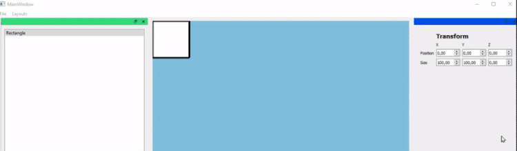
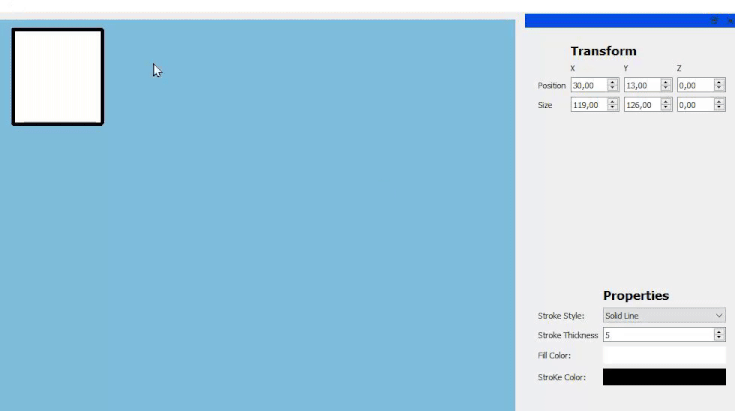
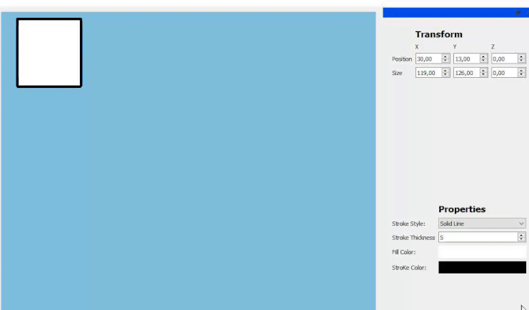
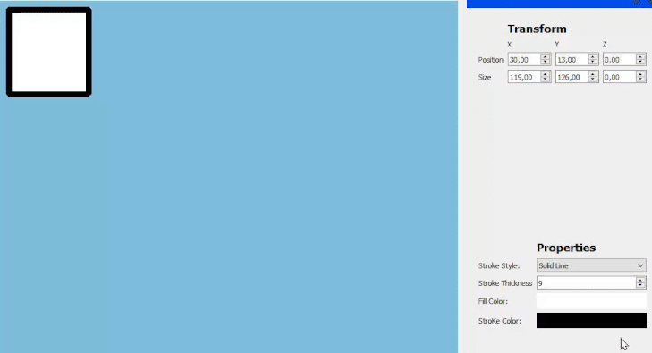
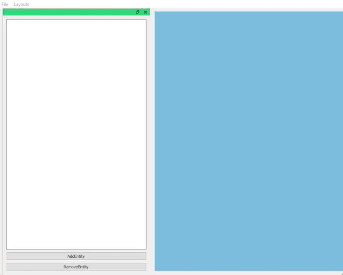
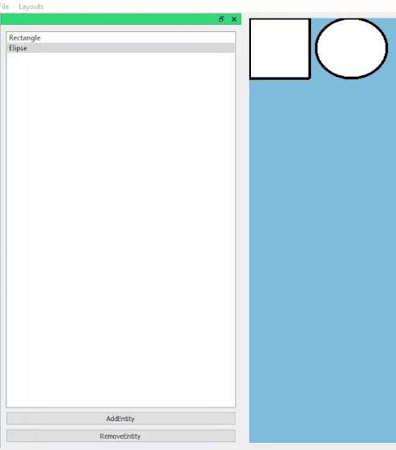
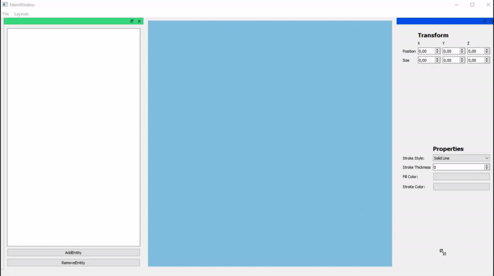

# Project1-Qt
A basic engine using Qt for the interface and C for the language.

By Pol Ferrando and Josep Pi

## List of features
### Inspector
- Transform

- Properties
  - Stroke Style
  
  
  
  - Stroke Tickness
  
  
  
  - Fill Color  
  - Stroke Color
  
  

### Hierarchy
- Add Entity

- Remove Entity

### Layouts
- Save and Load layouts

  
### Projects
- Save and load projects

